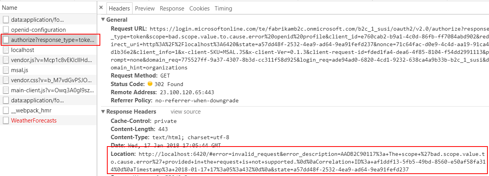
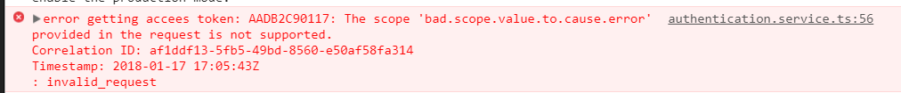

# How to Debug Errors in B2C

### Browser Tools
Turn on preserve logs in the console and network tabs as documented [here on Stack Overflow](https://stackoverflow.com/a/48235224/185123)

### Find Errors Returned from B2C in Network Tools



### MSAL Logging
Turn on msal logging

```
function loggerCallback(logLevel: any, message: any, piiLoggingEnabled: any) {
    console.log('msal.js: ' + message);
}

this.clientApplication =
    new UserAgentApplication(
        environment.clientID,
        this.authority,
        this.authCallback,
        {
            redirectUri: window.location.origin,
            logger: logger
        });
```

### MSAL Callback
Output `acquireTokenSilent` errors to the console

```
return this.clientApplication.acquireTokenSilent(badScope)
    .then(token => {
        return token;
    }).catch(error => {
        console.error('error getting accees token: ' + error);
        ...
        });
```

###### One Sample Error

>AADB2C90117: The scope 'bad.scope.value.to.cause.error' provided in the request is not supported.



